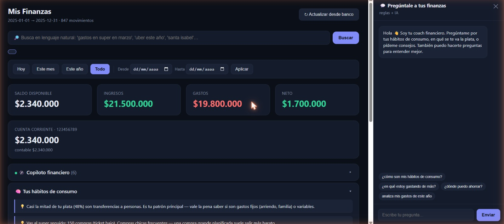
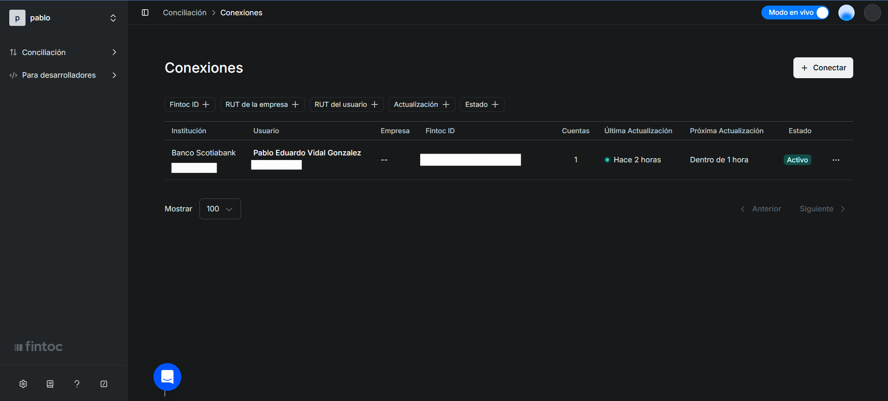

# Claude como Coach Financiero con Fintoc

Conecta tu banco chileno con [Fintoc](https://fintoc.com), baja tus movimientos y analízalos con un coach financiero impulsado por Claude (Anthropic).

[Fintoc](https://fintoc.com) es el puente: se conecta a tu banco de forma segura y expone tus movimientos vía API. Claude los lee, detecta patrones y responde cualquier pregunta sobre tu plata en español.

```
> en qué gasto más este año?

En lo que más gastas en 2025:
• TRANSFERENCIAS — $3.240.000 (48%)
• BENCINA — $890.000 (13%)
• SUPERMERCADO — $620.000 (9%)
• SUSCRIPCIONES / PAC — $180.000 (3%)

Casi la mitad de tu plata son transferencias a personas.
¿Son gastos fijos (arriendo, familia) o variables?
```

Funciona **sin pagar por IA** con un motor de reglas en español. Si tienes `ANTHROPIC_API_KEY`, el chat se convierte en coach conversacional con Claude real — preguntas abiertas, análisis de hábitos, consejos accionables.



---

## Bancos disponibles en Fintoc Chile

| Banco | Test | Live |
|---|---|---|
| Banco de Chile | ✅ | ✅ |
| Santander | ✅ | ✅ |
| BancoEstado | ✅ | ✅ |
| BCI / BCI 360 | ✅ | ✅ |
| Scotiabank | ✅ | ✅ |
| Itaú | ✅ | ✅ |
| BICE | ✅ | ✅ |
| Banco Security | ✅ | ✅ |

> **Modo test**: bancos simulados con datos de prueba — puedes probar todo sin conectar tu banco real.  
> **Modo live**: tu banco real. Requiere onboarding con Fintoc (gratis, 1-2 días).  
> Lista oficial y credenciales de prueba: [docs.fintoc.com](https://docs.fintoc.com/docs/products-and-institutions-movements)

---

## Setup

### 1. Crea cuenta en Fintoc

Ve a [fintoc.com](https://fintoc.com) → crea cuenta → **API Keys** → copia tu `sk_test_...` y `pk_test_...`

Así se ve el panel de Fintoc una vez que tienes tu banco conectado:



### 2. Instala

```bash
git clone https://github.com/pablovidal05/fintoc-analyzer
cd fintoc-analyzer
npm install
cp .env.example .env
```

### 3. Configura `.env`

```env
FINTOC_SECRET_KEY=sk_test_TU_KEY_AQUI
FINTOC_PUBLIC_KEY=pk_test_TU_KEY_AQUI

# Opcional — activa el coach IA con Claude
ANTHROPIC_API_KEY=sk-ant-TU_KEY_AQUI
```

Consigue tu Anthropic key en [console.anthropic.com](https://console.anthropic.com).

### 4. Conecta tu banco

```bash
npm run widget
```

Abre [http://localhost:4000](http://localhost:4000) → **Conectar banco** → elige tu banco → autentícate.  
El `link_token` y `account_id` se guardan solos en `.env`. Solo necesitas hacer esto una vez.

---

## Comandos

| Comando | Qué hace |
|---|---|
| `npm run ask` | Chat en terminal — pregúntale a Claude sobre tus gastos |
| `npm run dashboard` | Dashboard web con gráficos + chat en `localhost:4000/dashboard` |
| `npm start` | Resumen mensual ingresos / gastos / neto |
| `npm run overview` | Saldo actual, ranking de comercios, top gastos individuales |
| `npm run widget` | Conecta banco (solo una vez) |

### Ejemplos de preguntas

```
cuanto gaste en uber
cuanto gaste en supermercado en marzo
gastos en abril 2025
gastos recurrentes este año
en qué gasto más
resumen de este mes
```

---

## Dashboard web

```bash
npm run dashboard
# → http://localhost:4000/dashboard
```

- Saldo actual + KPIs
- Gráficos por mes (Chart.js)
- Filtro de fechas y búsqueda en lenguaje natural
- Panel "Tus hábitos" con categorías e insights
- Copiloto proactivo (detecta si vas ajustado, PAC alto, gasto hormiga)
- Chat con Claude o motor de reglas según si tienes `ANTHROPIC_API_KEY`

---

## Arquitectura

```
ask.js            Chat CLI con Claude (npm run ask)
index.js          Resumen mensual (npm start)
overview.js       Panorama completo (npm run overview)
server.js         Servidor: widget + dashboard + API de chat
lib.js            Fetch Fintoc, cache, categorización, nudges, analytics
chatlib.js        Motor de reglas: parse español, intents, búsqueda
public/
  index.html      Widget de conexión de banco
  dashboard.html  Dashboard visual con chat
.env.example      Plantilla de variables de entorno
movements.json    Cache local (gitignored — tus datos no se suben)
.env              Keys y tokens (gitignored)
```

### Flujo Fintoc API

```
POST /v1/link_intents              → widget_token
Widget (frontend) → usuario elige banco y se autentica
GET  /v1/links/exchange?token=...  → link_token + cuentas
GET  /v1/accounts/{id}/movements   → movimientos paginados
```

`amount` negativo = gasto, positivo = ingreso. Montos en CLP sin decimales.

---

## Limitaciones y cosas a tener en cuenta

**Fintoc modo live (banco real):**
- Requiere onboarding con Fintoc — proceso gratuito pero tarda 1-2 días hábiles
- El `link_token` puede expirar; si deja de funcionar, reconecta con `npm run widget`
- No todos los bancos muestran el mismo historial — algunos dan 3 meses, otros hasta 24
- Solo lectura: este proyecto solo baja movimientos, no mueve plata

**Cobertura:**
- Fintoc cubre Chile, México y Perú — pero este proyecto está pensado para Chile (montos en CLP, nombres de bancos y comercios chilenos)
- No todas las cuentas del banco quedan disponibles — depende de lo que el banco exponga vía Fintoc

**El coach IA:**
- Sin `ANTHROPIC_API_KEY` el chat responde con reglas en español — entiende las preguntas más comunes pero no análisis abierto
- Con la key activa usa `claude-opus-4-8` por defecto — tiene costo por token (muy bajo para uso personal, ~$0.01 por consulta)
- Los movimientos se mandan al prompt de Claude como contexto — no datos en tiempo real, sino el historial cacheado localmente

---

## Seguridad

- `.env` y `movements.json` en `.gitignore` — keys y datos bancarios nunca se suben a git
- `sk_` (secret key) solo en backend; nunca en el frontend ni en el código
- Si una key se filtra → rótala inmediatamente en el panel de Fintoc

---

## Licencia

MIT
